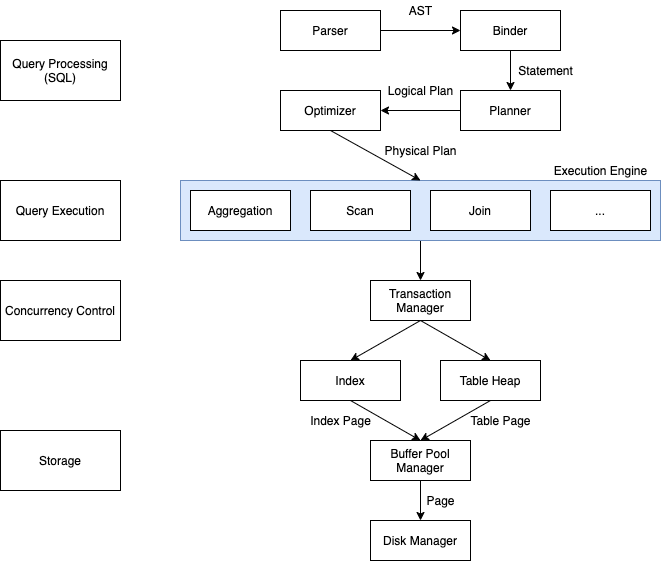

[English](./README_EN.md)

# tinysql - 简单关系型数据库 (基于 CMU 15-445 课程)
- [x] Disk Manager 磁盘管理
- [x] LRU-K置换算法
- [ ] 可扩展哈希表
- [x] 缓冲池管理
- [x] B+树索引
- [x] Table Heap 表堆
- [x] Catalog 元数据
- [x] Binder 绑定器
- [x] Planner 计划器
- [ ] 优化器
- [x] 火山模型执行器
- [ ] MVCC多版本并发控制
- [ ] 事务

## 架构


## 运行
安装rust工具链
```
cargo run
```
test command
```mysql
create table t1(a int, b int);

insert into t1 values(1,1),(2,3),(5,4);

select * from t1;

select * from t1 where a <= b;

select a from t1 where a <= b;
```


## 参考
- [CMU 15-445/645 Database Systems](https://15445.courses.cs.cmu.edu/fall2022/)
- [cmu-db/bustub](https://github.com/cmu-db/bustub)
- [SQLite 1.0 source code](https://www.sqlite.org/src/info/f37dd18e3fc6314e)
- [talent-plan/tinysql](https://github.com/talent-plan/tinysql)
- [CMU 15-445课程笔记-zhenghe](https://zhenghe.gitbook.io/open-courses/cmu-15-445-645-database-systems/relational-data-model)
- [CMU15-445 22Fall通过记录 - 知乎](https://www.zhihu.com/column/c_1605901992903004160)
- [B+ Tree Visualization](https://www.cs.usfca.edu/~galles/visualization/BPlusTree.html)

## 问题
**1.如何处理B+树节点上相同的key？**

**2.如果B+树节点的key大小超过页容量怎么处理？**