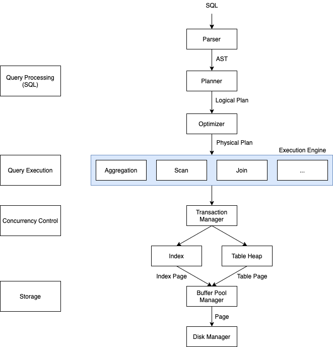
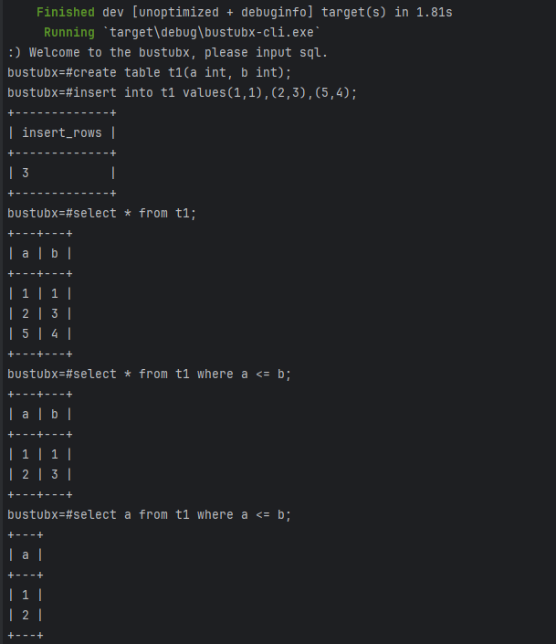

# BustubX - a relational database for educational purpose (CMU 15-445)
- [ ] DML
- [ ] DDL
- [ ] Rule-based Optimizer
- [ ] Parallel Execution
- [ ] B+ Tree Index
- [ ] Multi-Version Concurrency Control
- [ ] Crash Recovery

## Architecture



## Get started
Install rust toolchain first.
```
cargo run --bin bustubx-cli
```



## Reference
- [CMU 15-445/645 Database Systems](https://15445.courses.cs.cmu.edu/fall2022/)
- [cmu-db/bustub](https://github.com/cmu-db/bustub)
- [Fedomn/sqlrs](https://github.com/Fedomn/sqlrs) and [blogs](https://frankma.me/categories/sqlrs/)
- [KipData/KipSQL](https://github.com/KipData/KipSQL)
- [talent-plan/tinysql](https://github.com/talent-plan/tinysql)
- [CMU 15-445课程笔记-zhenghe](https://zhenghe.gitbook.io/open-courses/cmu-15-445-645-database-systems/relational-data-model)
- [CMU15-445 22Fall通关记录 - 知乎](https://www.zhihu.com/column/c_1605901992903004160)
- [B+ Tree Visualization](https://www.cs.usfca.edu/~galles/visualization/BPlusTree.html)